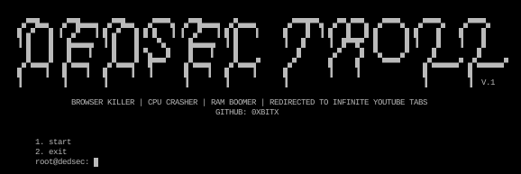

<h1 align="center"> DEDSEC TROLL PAGE </h1>
<h4 align="center">DEDSEC TROLL PAGE is a page can overload your cpu, ram by redirecting to infinite youtube tab.</h4>

### DESCRIPTION
DEDSEC TROLL PAGE is a potentially harmful online activity that can overload CPU and RAM by redirecting to infinite YouTube tabs. If you encounter such a page, do not interact with it and report it to platform administrators or authorities. Engaging in or promoting such activities is against ethical guidelines and may have legal consequences. If you experience issues, close the browser tab, and stay informed about cybersecurity best practices.

### SITE
    https://0xbitx.github.io/Dedsec-Troll/

### INSTALLATION
* git clone https://github.com/0xbitx/Dedsec-Troll.git
* cd Dedsec-Troll
* chmod +x dedsec-troll
* sudo ./dedsec-troll

### TESTED ON FOLLOWING:-
* Kali Linux 
* Parrot OS 
* Ubuntu

## Support

If you find my work helpful and want to support me, consider making a donation. Your contribution will help me continue working on open-source projects.

**Bitcoin Address: `36ALguYpTgFF3RztL4h2uFb3cRMzQALAcm`**

<h1 align="center"> DISCLAIMER </h1>

<h4 align="center">I'm not responsible for anything you do with this program, so please only use it for good and educational purposes. </h4>
